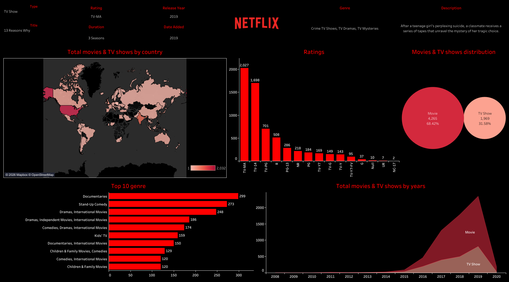

# Netflix Tableau Dashboard 🎬📊

An interactive **Tableau dashboard** exploring Netflix content trends by **country, rating, genre, and release year**.

This project helps answer questions like:
- Which countries produce the most Netflix content?
- What are the most common content ratings?
- What genres dominate Netflix?
- How has Netflix content changed over time?

---

## 🔗 Live Dashboard (Tableau Public)
👉 https://public.tableau.com/app/profile/rosalyn.ezeako/viz/Netflix_17688497456620/Netflix?publish=yes

---

## 📸 Dashboard Preview

---

## 📂 Project Structure

Netflix-Tableau-Dashboard/
├── README.md
├── data/
│ └── netflix_titles.csv
├── images/
│ └── Netflix.png
└── tableau/
└── Netflix.twbx

---

## 📌 Files Included

### ✅ Tableau Workbook
- `tableau/Netflix.twbx`  
  Packaged Tableau workbook (recommended format for sharing).

### ✅ Dataset
- `data/netflix_titles.csv`  
  Original dataset used for the dashboard.

### ✅ Dashboard Image
- `images/dashboard-preview.png`  
  Screenshot preview of the Tableau dashboard.

---

## 🛠 Tools Used
- **Tableau Desktop**
- **Tableau Public**
- **Data Visualization**
- **CSV Dataset**

---

## ▶️ How to Open Locally (Tableau Desktop)
1. Download this repository (Code → Download ZIP) or clone it.
2. Open the packaged workbook:

   `tableau/Netflix.twbx`

✅ Since it’s a `.twbx`, it includes the data and should open without re-linking.

